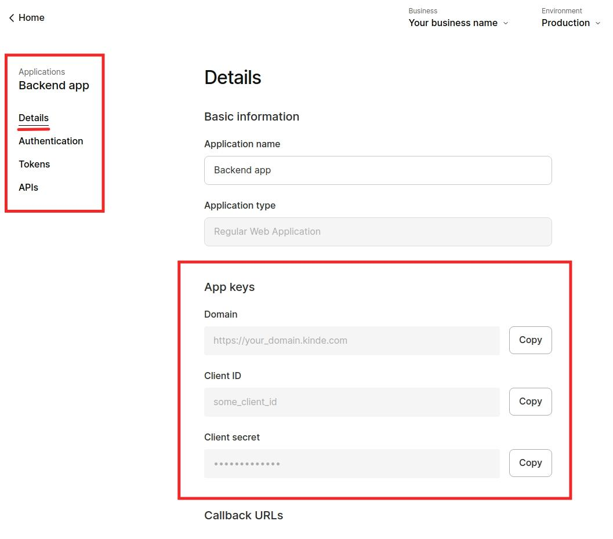

# Kinde PHP SDK

The Kinde PHP SDK allows developers to integrate with Composable Commerce APIs using PHP native interfaces, models and helpers instead of manually using the HTTP and JSON API.

## Register for Kinde

If you haven’t already got a Kinde account, [register for free here](http://app.kinde.com/register) (no credit card required).

You need a Kinde domain to get started, e.g. `yourapp.kinde.com`.

## Installation

Install [Composer](https://getcomposer.org/) and then execute the following command:

```bash
php composer.phar require kinde-oss/kinde-auth-php

// or

composer require kinde-oss/kinde-auth-php
```

Or add the following to your `composer.json` file:

```json
{
    "repositories": [
        {
            "type": "vcs",
            "url": "https://github.com/kinde-oss/kinde-auth-php"
        }
    ],
    "require": {
        "kinde-oss/kinde-auth-php": "*",
        "php": "^7.4 || ^8.0",
        "ext-curl": "*",
        "ext-json": "*",
        "ext-mbstring": "*",
        "guzzlehttp/guzzle": "^7.3",
        "guzzlehttp/psr7": "^1.7 || ^2.0"
    },
    "autoload": {
        "psr-4": {"Kinde\\KindeSDK\\": "lib/"}
    }
}
```

Then, update dependencies as follows:
```bash
php composer.phar update

// or

composer update
```

## Getting Started

## Kinde configuration

On the Kinde web app navigate to **Settings** in the left menu, then select **Applications** and select your app (e.g: the **Backend** app). Scroll down to the **Callback URLs** section.

Here you want to put in the **callback URLs** for your React Native app, which should look something like this:
- Allowed callback URLs - for example, `https://localhost:8000/callback`
- Allowed logout redirect URLs - for example, `https://localhost:8000`

Make sure you press the **Save** button at the bottom of the page!

### Environments

If you would like to use our Environments feature as part of your development process. You will need to create them first within your Kinde account. In this case you would use the Environment subdomain in the code block above.

### Configure your app

#### Environment variables

The following variables need to be replaced in the code snippets below.

-   `KINDE_HOST` - your Kinde domain - e.g. `https://your_kinde_domain.kinde.com`
-   `KINDE_REDIRECT_URL` - your callback url, make sure this URL is under your allowed callback redirect URLs. - e.g. `http://localhost:8000/callback`
-   `KINDE_POST_LOGOUT_REDIRECT_URL` - where you want users to be redirected to after logging out, make sure this URL is under your allowed logout redirect URLs. - e.g. `http://localhost:8000`
-   `KINDE_CLIENT_ID` - you can find this on the **Application Details => App keys** - e.g. `your_kinde_client_id`
-   `KINDE_CLIENT_SECRET` - you can find this on the **Application Details => App keys** - e.g. `your_kinde_client_secret`


### Integration your app

Add the composer autoloader to your app.

```php
...

require_once(__DIR__ . '/vendor/autoload.php');

```

Create a new instance of the `KindeClientSDK` object in constructor or wherever. In this example, we will add this into constructor

```php
...

use Kinde\KindeSDK\KindeClientSDK;
use Kinde\KindeSDK\Configuration;
use Kinde\KindeSDK\Sdk\Enums\GrantType;

...

private $kindeClient;
private $kindeConfig;


public function __construct()
{
    $this->kindeClient = new KindeClientSDK(
        'KINDE_HOST', 
        'KINDE_REDIRECT_URL', 
        'KINDE_CLIENT_ID', 
        'KINDE_CLIENT_SECRET', 
        'KINDE_GRANT_TYPE', 
        'KINDE_POST_LOGOUT_REDIRECT_URL'
    );
    $this->kindeConfig = new Configuration();
    $this->kindeConfig->setHost('KINDE_HOST');
}
```

### Login and registration

The Kinde client provides methods for easy to implement login / registration.

You can add buttons in your HTML as follows:

```html
<div class="navigation">
    <a href="/login" type="button">Login</a>
    <a href="/register" type="button">Register</a>
</div>
```

You will then need to route /login and /register to functions that call the SDK methods, for example:

```php
public function login()
{
    $this->kindeClient->login();
}

public function register()
{
    $this->kindeClient->register();
}
```

### Manage redirects

When the user is redirected back to your site from Kinde, this will call your callback URL defined in the `KINDE_REDIRECT_URL` variable. You will need to route `/callback` to call a function to handle this.

```php
public function callback()
{
    $token = $this->kindeClient->getToken();
    $this->kindeConfig->setAccessToken($token->access_token);
    print_r($token);
}
```

### Logout

The Kinde SPA client comes with a logout method.

```php
$this->kindeClient->logout();
```

### Get user information

You need to have already authenticated before you call the API, otherwise an error will occur.

Use the `Kinde\KindeSDK\Api\OAuthApi` class, then call the `getUser` method.

```php
...

use Kinde\KindeSDK\Api\OAuthApi;

...

public function getProfile()
{
    if ($this->kindeClient->isAuthenticated) {
        $apiInstance = new OAuthApi($this->kindeConfig); // You have already defined `$this->kindeConfig` in the construction function

        try {
            $result = $apiInstance->getUser();
            print_r($result);
        } catch (Exception $e) {
            echo 'Exception when calling UserApi->getUser: ', $e->getMessage(), PHP_EOL;
        }
    }
}
```


### View users in Kinde

If you navigate to the "Users" page within Kinde you will see your newly registered user there. 🚀

### User Permissions

Once a user has been verified as login in, your product/application will be returned the JWT token with an array of permissions for that user. You will need to configure your product/application to read permissions and unlock the respective functions.

You set Permissions in your Kinde account (see help article), the below is an example set of permissions.

```php
"permissions" => [
    "create:todos",
    "update:todos",
    "read:todos",
    "delete:todos",
    "create:tasks",
    "update:tasks",
    "read:tasks",
    "delete:tasks",
];
```
We provide helper functions to more easily access permissions:

```php
$this->kindeClient->getPermission('create:todos');
// ['orgCode' => 'org_1234', 'isGranted' => true]

$this->kindeClient->getPermissions();
// ['orgCode' => 'org_1234', 'permissions' => ['create:todos', 'update:todos', 'read:todos']]
```

A practical example in code might look something like:

```php
if ($this->kindeClient->getPermission("create:todos")['isGranted']) {
    // create new a todo
}
```
### Audience

An `audience` is the intended recipient of an access token - for example the API for your application. The audience argument can be passed to the Kinde client to request an audience be added to the provided token.

The audience of a token is the intended recipient of the token.

```php
...
public function __construct()
{
   $this->kindeClient = new KindeClientSDK(
        'KINDE_HOST', 
        'KINDE_REDIRECT_URL', 
        'KINDE_CLIENT_ID', 
        'KINDE_CLIENT_SECRET', 
        'KINDE_GRANT_TYPE', 
        'KINDE_POST_LOGOUT_REDIRECT_URL', 
        'YOUR_SCOPES', 
        [
        'audience' => 'api.yourapp.com' // <-- Added here
        ]
   );
   ...
}
```

For details on how to connect, see [Register an API](https://kinde.com/docs/developer-tools/register-an-api/)

### Overriding scope

By default the KindeSDK SDK requests the following scopes:

-   profile
-   email
-   offline
-   openid

You can override this by passing scope into the KindeSDK

```php
...
public function __construct()
{
   $this->kindeClient = new KindeClientSDK(
        'KINDE_HOST', 
        'KINDE_REDIRECT_URL', 
        'KINDE_CLIENT_ID', 
        'KINDE_CLIENT_SECRET', 
        'KINDE_GRANT_TYPE', 
        'KINDE_POST_LOGOUT_REDIRECT_URL', 
        'profile email offline openid' // <-- Added here
    );
   ...
}
```

### Getting claims

We have provided a helper to grab any claim from your id or access tokens. The helper defaults to access tokens:

```php
$this->kindeClient->getClaim('aud');
// ['name' => 'aud', 'value' => ["api.yourapp.com"]]

$this->kindeClient->getClaim('given_name', 'id_token');
// ['name' => 'given_name', 'value' => 'David']
```

### Organizations Control

#### Create an organization

To have a new organization created within your application, you will need to run a similar function to below:

```php
public function register()
{
    $this->kindeClient->createOrg();
}
```

You can also pass `org_name` as your organization
```php
...
$this->kindeClient->createOrg(['org_name' => 'Your Organization']);
...
```

#### Sign up and sign in to organizations

Kinde has a unique code for every organization. You’ll have to pass this code through when you register a new user. Example function below:

```php
$this->kindeClient->register(['org_code' => 'your_org_code']);
```

If you want a user to sign into a particular organization, pass this code along with the sign in method.

```php
$this->kindeClient->login(['org_code' => 'your_org_code']);
```

Following authentication, Kinde provides a json web token (jwt) to your application. Along with the standard information we also include the org_code and the permissions for that organization (this is important as a user can belong to multiple organizations and have different permissions for each). Example of a returned token:

```json
{
    "aud": [],
    "exp": 1658475930,
    "iat": 1658472329,
    "iss": "https://your_subdomain.kinde.com",
    "jti": "123457890",
    "org_code": "org_1234",
    "permissions": ["read:todos", "create:todos"],
    "scp": ["openid", "profile", "email", "offline"],
    "sub": "kp:123457890"
}
```

The id_token will also contain an array of organization that a user belongs to - this is useful if you want to build out an organization switcher for example.

```json
{
...
"org_codes": ["org_1234", "org_4567"]
...
}
```

There are two helper functions you can use to extract information:

```php
$this->kindeClient->getOrganization();
// ['orgCode' => 'org_1234']

$this->kindeClient->getUserOrganizations();
// ['orgCodes' => ['org_1234', 'org_abcd']]
```

### Feature Flags

We have provided a helper to grab any feature flag from `access_token`:
```php
$this->kindeClient->getFlag('theme');
// returns
[
    "code" => "theme", 
    "type" => "string", 
    "value" => "pink",
    "is_default" => false // whether the fallback value had to be used
]

// Another usage case
$this->kindeClient->getFlag('is_dark_mode');
// returns
[
    "code": "is_dark_mode", 
    "type": "boolean", 
    "value": true,
    "is_default": false
]

// This flag does not exist - default value provided
$this->kindeClient->getFlag('create_competition', ["defaultValue" => false]);
// returns
[
    "code": "create_competition",
    "type" => "boolean", 
    "value": false,
    "is_default": true // because fallback value had to be used
]

// The flag type was provided as string, but it is an integer
$this->kindeClient->getFlag('competitions_limit', {defaultValue: 3}, 's');
// should error out - Flag "competitions_limit" is type integer - requested type string


// This flag does not exist, and no default value provided
$this->kindeClient->getFlag('new_feature');
// should error out - This flag was not found, and no default value has been provided
```
We also provide wrapper functions which should leverage `getFlag` above:
```php
// [--- Boolean ---]
$this->kindeClient->getBooleanFlag('is_dark_mode');

// with default value
$this->kindeClient->getBooleanFlag('is_dark_mode', false);
// [--- Boolean ---]


// [--- String ---]
$this->kindeClient->getStringFlag('theme');

// with default value
$this->kindeClient->getStringFlag('theme', 'blue');
// [--- String ---]


// [--- Integer ---]
$this->kindeClient->getIntegerFlag('competitions_limit');

// with default value
$this->kindeClient->getIntegerFlag('competitions_limit', 1);
// [--- Integer ---]
```

## Token Storage
Once the user has successfully authenticated, you'll have a JWT and a refresh token and that has been stored securely. E.g. using the `getAccessToken` method of the `Storage` class to get an access token.

```php
...
use Kinde\KindeSDK\Sdk\Storage\Storage;
...

$storage = Storage::getInstance();

$accessToken = $storage->getAccessToken();

print_r($accessToken);
```

The token will be stored in the cookie. To specify the expiration time, you can use the `setTokenTimeToLive` method.

```php
$storage->setTokenTimeToLive(time() + 3600) // Live in 1 hour
```

## How to run test

The simplest way to run the PHP test suite is by using the following command at the root of your PHP checkout:

```bash
composer test
```

_Note: Ensure you have already run `composer install` before_

## SDK API Reference

| Property                        | Type    | Is required                             | Default                      | Description                                                                                                                                     |
| ------------------------------- | ------- | --------------------------------------- | ---------------------------- | ----------------------------------------------------------------------------------------------------------------------------------------------- |
| domain                          | string  | Yes                                     |                              | Either your Kinde instance url or your custom domain. e.g https://yourapp.kinde.com |
| redirectUri                     | string  | Yes                                     |                              | The url that the user will be returned to after authentication                                                                                  |
| clientId                        | string  | Yes                                     |                              | The client id of your application - get this from the Kinde admin area                                                                          |
| clientSecret                    | string  | Yes - if you use Client Credential Flow |                              | The client secret of your application - get this from the Kinde admin area                                                                      |
| grantType                       | string  | Yes                                     |                              | The grant type to define is the flow that will be used                                                                                          |
| logoutRedirectUri               | string  | No                                      |                              | Where your user will be redirected upon logout                                                                                                  |
| scope                           | boolean | No                                      | openid profile email offline | The scopes to be requested from Kinde                                                                                                           |
| additionalParameters            | object  | No                                      | {}                           | Additional parameters that will be passed in the authorization request                                                                          |
| additionalParameters - audience | string  | Yes - if you use Client Credential Flow |                              | The audience claim for the JWT                                                                                                                  |

## KindeSDK methods

| Property             | Description                                                                                       | Arguments                                                      | Usage                                                                                         | Sample output                                                                                                                                                                                  |
| -------------------- | ------------------------------------------------------------------------------------------------- | -------------------------------------------------------------- | --------------------------------------------------------------------------------------------- | ---------------------------------------------------------------------------------------------------------------------------------------------------------------------------------------------- |
| login                | Constructs redirect url and sends user to Kinde to sign in                                        | org_code?: string                                              | $kinde->login();<br>// or<br>$kinde->login(['org_code' => 'your_org_code']);<br>              |                                                                                                                                                                                                |
| register             | Constructs redirect url and sends user to Kinde to sign up                                        | org_code?: string                                              | $kinde->register();<br>// or<br>$kinde->register(['org_code' => 'your_org_code']);            |                                                                                                                                                                                                |
| logout               | Logs the user out of Kinde                                                                        |                                                                | $kinde->logout();                                                                             |                                                                                                                                                                                                |
| getToken             | Returns the raw token from Kinde                                                                  |                                                                | $kinde->getToken();                                                                           | {"access_token":"eyJhbGciOiJSUzI1Ni...","expires_in":86400,"id_token":"eyJhbGciOiJSUzI1Ni...","refresh_token":"7W7DkUVqBlMe....","scope":"openid profile email offline","token_type":"bearer"} |
| createOrg            | Constructs redirect url and sends user to Kinde to sign up and create a new org for your business | org_name?: string                                              | $kinde−>createOrg();<br>// or<br>$kinde->createOrg(['org_name' => 'your organization name'}); |                                                                                                                                                                                                |
| getClaim             | Gets a claim from an access or id token                                                           | claim: string, tokenKey?: string                               | $kinde->getClaim('given_name', 'id_token');                                                   | ['name' => 'given_name', 'value' => 'David']                                                                                                                                                   |
| getPermission        | Returns the state of a given permission                                                           | key: string                                                    | $kinde->getPermission('read:todos');                                                          | ['orgCode'=>′org_1234′,'isGranted'=>true]                                                                                                                                                      |
| getPermissions       | Returns all permissions for the current user for the organization they are logged into            |                                                                | $kinde->getPermissions();                                                                     | ['orgCode' => 'org_1234', 'permissions' => ['create:todos', 'update:todos', 'read:todos']]                                                                                                     |
| getOrganization      | Get details for the organization your user is logged into                                         |                                                                | $kinde->getOrganization();                                                                    | ['orgCode' => 'org_1234']                                                                                                                                                                      |
| getUserDetails       | Returns the profile for the current user                                                          |                                                                | $kinde->getUserDetails();                                                                     | ['given_name' => 'Dave', 'id '=> 'abcdef', 'family_name' => 'Smith', 'email'=> 'dave@smith.com']                                                                                               |
| getUserOrganizations | Gets an array of all organizations the user has access to                                         |                                                                |                                                                                               | ['orgCodes' => ['org_1234', 'org_abcd']]                                                                                                                                                       |
| getFlag              | Gets a feature flag from an access token                                                          | flagName: string,<br>options?: [<br>'defaultValue' => any<br>] | $kinde->getFlag('is_dark_mode');                                                              | [<br>"code": "is_dark_mode",<br>"type": "boolean",<br>"value": true,<br>"is_default": false<br>]                                                                                               |
| getBooleanFlag       | Gets a boolean feature flag from an access token                                                  | flagName: string,<br>defaultValue?: boolean                    | $kinde->getBooleanFlag('is_dark_mode', false);                                                | [<br>"code": "is_dark_mode",<br>"type": "boolean",<br>"value": false,<br>"is_default": true<br>]                                                                                               |
| getStringFlag        | Gets a string feature flag from an access token                                                   | flagName: string,<br>defaultValue?: string                     | $kinde->getStringFlag('theme');                                                               | [<br>"code": "theme",<br>"type": "string",<br>"value": 'black',<br>"is_default": false<br>]                                                                                                    |
| getIntegerFlag       | Gets a integer feature flag from an access token                                                  | flagName: string,<br>defaultValue?: integer                    | $kinde->getIntegerFlag('competitions_limit');                                                 | [<br>"code": "competitions_limit",<br>"type": "integer",<br>"value": 1,<br>"is_default": false<br>]                                                                                            |
| isAuthenticated      | To check user authenticated or not                                                                |                                                                | $kinde->isAuthenticated                                                                       | \`true\` or \`false\`                                                                                                                                                                          |
If you need help connecting to Kinde, please contact us at [support@kinde.com](mailto:support@kinde.com).
